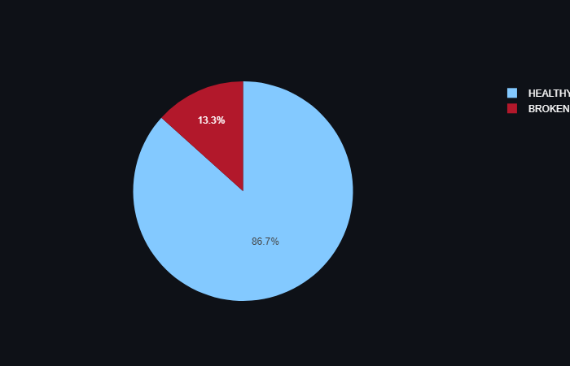

# Web Page Linking Health
Python Data Service that Analyze your webpage and check for the health of 𝐔𝐑𝐋𝐬 and linking in it. It will give you detailed information about meta data of your referenced URLs and list the broken links in it.

This tool is useful when checking any webpage content(URLs Health) such as blog. Also, it can be used in **SEO** validation for any website sitemap. 

I have optimized the service using 𝐀𝐬𝐲𝐧𝐜𝐡𝐫𝐨𝐧𝐨𝐮𝐬 𝐌𝐮𝐥𝐭𝐢-𝐓𝐡𝐫𝐞𝐚𝐝𝐢𝐧𝐠 to enhance the performance of processing the links in the webpage. It takes about 25 sec to process 200 URLs instead of at least 60 sec.

## How to Call it

The main app contains 2 functions:
* analyze_webpage()
* analyze_webpage_opt() 

The second function performance optimized using 𝐌𝐮𝐥𝐭𝐢-𝐓𝐡𝐫𝐞𝐚𝐝𝐢𝐧𝐠 

You can use either functions by passing the url of the webpage as parameter and it will return the result in Dictionary containing information of webpage analysis 

The web service also has **st_ui** function included in the app to render the user interface of the application and run it using [Streamlit](https://streamlit.io/).

## Example of Running the Service

We can run it on this [blog url](https://www.linkedin.com/pulse/leveraging-python-faas-deploy-impactful-data-ml-services-oghli/)

It will give the result for checking the URLs in the blog like following:


### Brief Information
```
____________Summary______________
Webpage Title: Leveraging Python FAAS to Deploy Impactful Data and ML Services
Total link: 64
Total Healthy link: 13
Total Broken link: 2
Average Healthy linking: 20.31 %
Analyzing Elapsed Time: 23.36 seconds
```
### URL HEALTH


### Detailed Information

**Healthy Links Source**
```
research paper [https://arxiv.org/abs/1807.06779]

Intel OpenVino [https://docs.openvino.ai/latest/omz_models_model_single_image_super_resolution_1032.html]

full session [https://youtu.be/V81FTbNQBAk]

Text Classification [https://github.com/mohammad-oghli/Text-Classification.git]

Vehicle Recognition [https://github.com/mohammad-oghli/Vehicle-Recognition.git]

vehicle-detection-0200 [https://github.com/openvinotoolkit/open_model_zoo/tree/master/models/intel/vehicle-detection-0200]

vehicle-attributes-recognition-barrier-0039 [https://github.com/openvinotoolkit/open_model_zoo/tree/master/models/intel/vehicle-attributes-recognition-barrier-0039]

Web Page Analyzer [https://github.com/mohammad-oghli/WebPage-Analyzer.git]

Text File Analyzer [https://github.com/mohammad-oghli/Text-File-Analyzer.git]

Hugging Face [https://huggingface.co/]

Streamlit Cloud [https://streamlit.io/cloud]

best free alternative platforms [https://www.kdnuggets.com/2022/05/5-free-hosting-platform-machine-learning-applications.html]

GitHub account [https://github.com/mohammad-oghli]
```
**Broken Links Source**
```
Daisi [https://app.daisi.io]

Image Super Resolution (2nd place winner) [https://app.daisi.io/daisies/oghli/Image%20Super%20Resolution%20/app]
```


